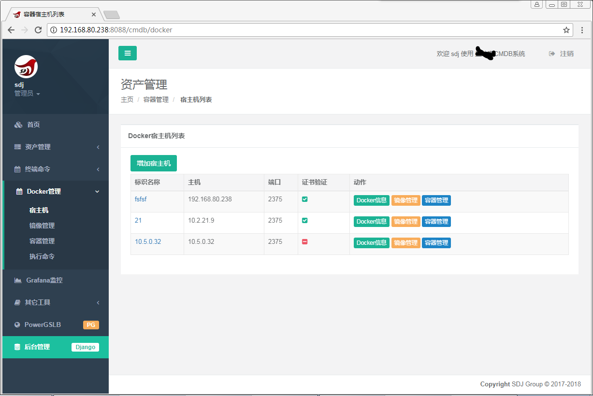
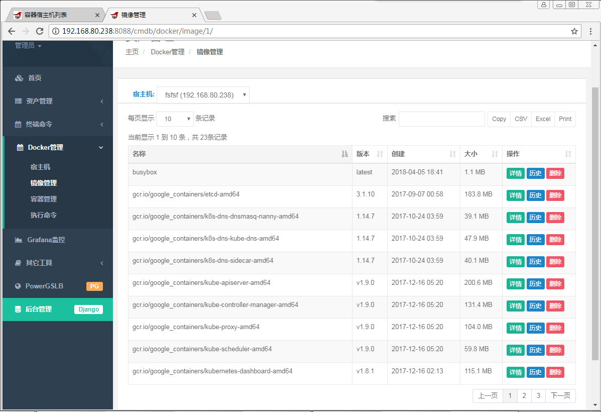
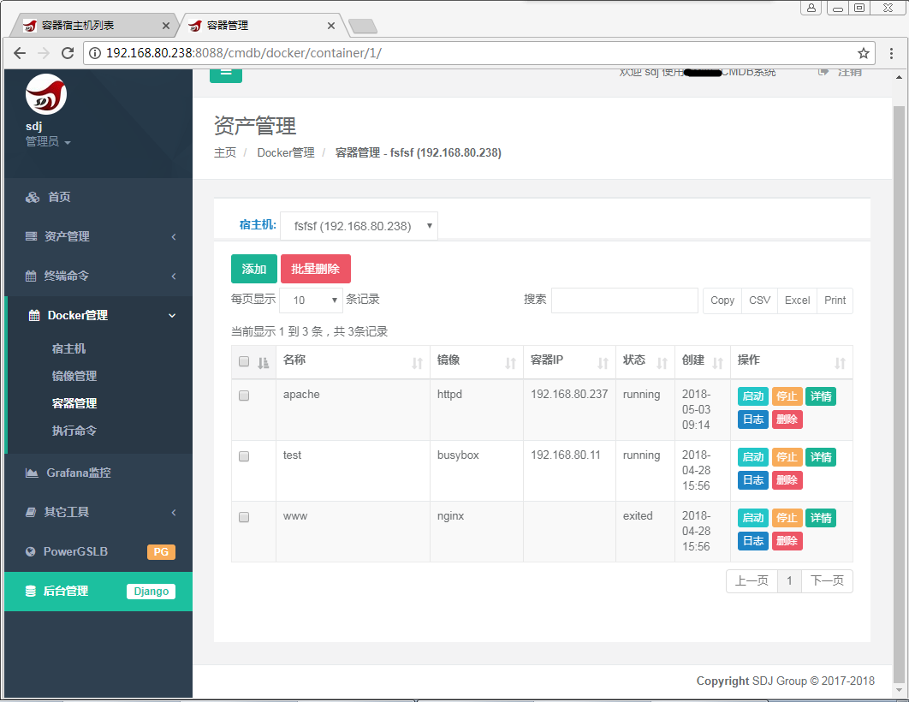
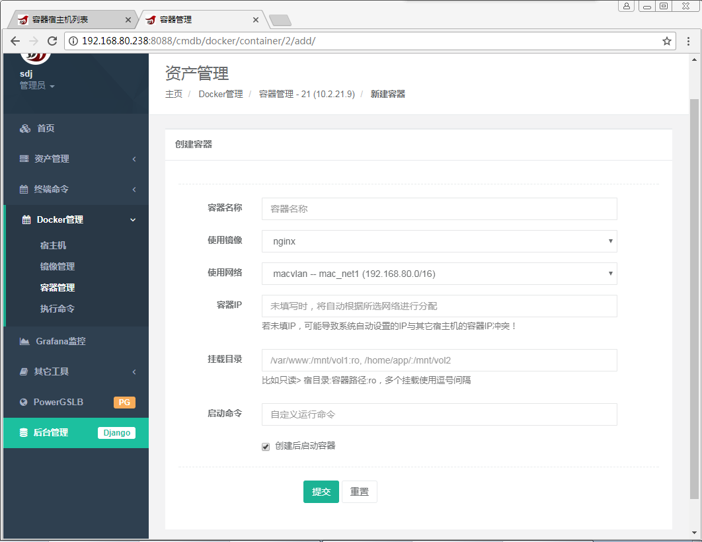

# 本项目已停止更新，和webssh合并到另一项目中 [py2010/cmdb](https://github.com/py2010/cmdb)

# Django Docker管理
通过网络管理多台物理宿主机，在物理机上管理docker容器。
因为docker 2375端口默认无安全验证，可开启SSL证书，客户端需用私钥访问docker 2375服务端。

* 特色
        
        1. 通过网络管理docker，这样可同时管理多台物理宿主机。目前看市面上这些功能大多都是单机版；
        2. docker服务端配置好后，2375端口透明支持SSL证书验证，
        物理宿主机添加管理时直接使用IP，无需设置hosts泛域名解析等任何额外设置。
        
        
* 说明
        
        本项目只是一些文件合并在一起，因为是从我的CMDB大项目中拆出来的，拆得太麻烦太累懒得详细弄，
        所以只把文件放出来，未实际新建django项目跑，也没时间或以后再弄，所以项目不适合python/django全新的初级新手，
        大家可自行修整编辑加到自己项目中，静态资源文件和_base.html等基础模板文件在另一项目webssh中有。

* 开发目的:
        
        公司本打算上k8s，但不能修改现有网络结构，因金融公司有很多监管要求限制，
        都是物理机自建网络，通过防火墙来控制docker主机互通。
        而采用k8s的话，多台物理机之间直接互通，相当于VPN拨号到同一网络，不再受硬件防火墙、A10负载影响。
        所以最终打算自定义开发，目前已具备基本的docker日常管理操作功能，其它新功能仍在添加完善中。。。。

* 环境：
        
        centos7 python2.7,
        客户端docker版本最好是大于1.12或docker CE，我目前测试宿主机都是使用docker CE，
        要求能支持swarm的docker版本，只用于开启2375监听端口，使能通过网络来控制docker宿主。
        由于swarm还比较初始，swarm功能不使用比如docker service等，实际并不使用swarm和集群，
        几台物理机都只开个2375端口，使能通过网络在各物理机上创建管理容器。

* 宿主机开启docker端口:
        
        vi /etc/sysconfig/docker
        DOCKER_OPTS="-H 0.0.0.0:2375 -H unix:///var/run/docker.sock"

        或
        vim /usr/lib/systemd/system/docker.service

        [Service]
        ExecStart=/usr/bin/dockerd -H tcp://0.0.0.0:2375 -H unix://var/run/docker.sock
        #重启服务端生效
        systemctl restart docker

* 开启SSL(可选)：
        
        因Docker-API不会进行安全验证，任意接入的客户端都能进行所有操作，为安全需配置TLS，客户端需使用SSL证书访问API接口，
        如果只是测试、演示，也可不用配置TLS。
        详细配置见2375文件夹

物理机、宿主机列表

镜像管理

容器管理

容器添加

